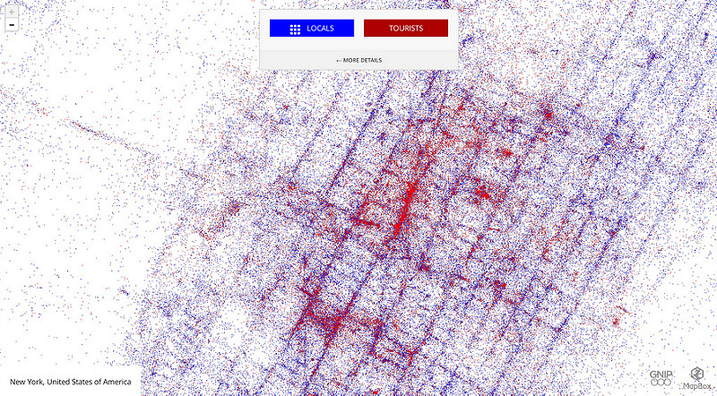
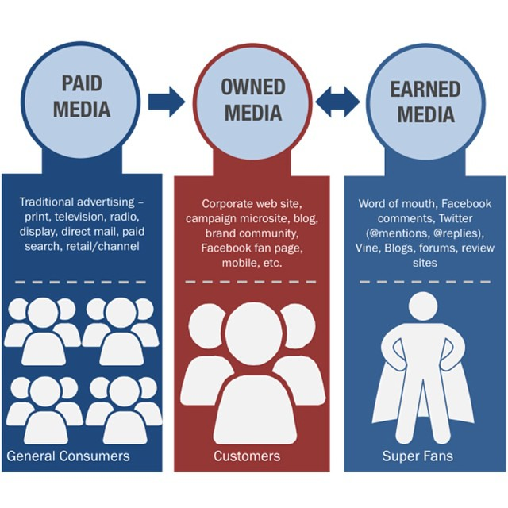
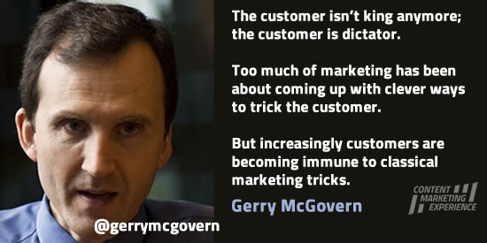

# {#overview .step data-scale=10}

# "Make your customer the hero of you story!" {.step .slide .title data-x=-1000}

Content Marketing and Content Strategy

[\@heinz](https://twitter.com/heinz?lang=de)

# "Every Company is a Media Company" {.step .slide .title}

Why brands become publishers

# {.step .slide data-x=1000 daty-y=-2000 data-z=-2000}

We live in a society in which we are increasingly connected by digital technology. In this society the public sphere is no longer produced by the mass media. More and more economic processes are happening publicly and in a networked way. Whoever is participating in society is produces content about themselves and about everything they are doing and is perceived via this content.

Content strategy is nothing else than a strategic approach to this content. Content marketing means to use this content in a targeted way for marketing purposes. Brands are perceived via content because they are acting today in a networked way, publicly and in realtime.

<!-- Digital Touchpoints and CoCreation -->

# Changing relations between brands and customers {.title .step .slide .data data-x=1000}

# {.step .slide data-x=1000 data-y=1000}

](https://creativecommons.org/licenses/by-sa/4.0/)](https://upload.wikimedia.org/wikipedia/commons/b/ba/Centralised-decentralised-distributed.png){ width=775px }

Customers and brands are nodes in a networked society.

<small style="font-size: small">Illustration:  1983~enwiki at English Wikipedia</small>

# {.step .slide data-x=1000 data-y=2000}

Customers and brands are connected 24/7 in realtime

# {.step .slide data-x=1000 data-y=3000}

"){ width=775px }

Customers regard brands as networked problem solvers

<small style="font-size:small">Illustration: Win Rampen</small>

# {.step .slide data-x=1000 data-y=4000}

{ width=775px }

The mass of disposable data is growing exponentially

<small style="font-size: small">Illustration: Mapbox https://www.flickr.com/photos/mapbox/ </small> 

<!-- New Audiences -->

# New media - new audiences {.step .slide .title data-x=2000 }

# {.step .slide data-y=1000 data-x=2000}
It is easier to publish than not to publish

# {.step .slide data-y=2000 data-x=2000}
Customers inform themselves online before all

# {.step .slide data-y=3000 data-x=2000}
Search engines promote quality content

# {.step .slide data-y=4000 data-x=2000}
In social media good content is a conditon for success

# {.step .slide data-y=5000 data-x=2000}
Content everywhere: from digital to mobile revolution

# {.step .slide data-y=6000 data-x=2000}
Classical ads and banners have lost traction

# {.step .slide data-y=7000 data-x=2000}
Scarcity of attention has replaced scarcity of information

# {.step .slide data-y=8000 data-x=2000}
Filters are replacing gatekeepers and mediators

# {.step .slide data-y=90000 data-x=2000}
The business models of publishing houses and media companies are obsolete

<!-- Content Marketing as a movement -->

# Content marketing between movement and hype {.step .slide data-x=3000}

<small style="font-size:small">Illustration: TopRank Marketing</small>

# {.step .slide data-y=1000 data-x=3000}
> The era of one-way, single-threaded, brand-directed mass communications is officially over. ... The only way to reach your audience in today’s information-drenched, content-saturated world is through Epic Content Marketing that emotionally connects with the people you are trying to reach." (@pulizzi2013a, loc. 96-104)

# Nielsen/Inpowered: {.step .slide data-y=2000 data-x=3000}

> Overall, our research suggests that there is a higher degree of trust from consumers when they are reading content from credible, third party experts. This trust is demonstrated by the higher lift scores with regard to product familiarity, affinity and purchase intent and its perception of being highly informative and unbiased. This level of trust further suggests that expert content is more efficient at pushing consumers along the consumer decision-making process because it is more effective at consistently lifting these measures across each phase of the purchase process. While expert content was impactful across product categories, its impact seems to be even more pronounced with higherpriced items.

[The Role of Content in the Consumer Decision Making Process](https://www.inpwrd.com/the_role_of_content_inpowered.pdf "The Role of Content in the Consumer Decision Making Process")

# Content marketing is owning media as opposed to renting it (Joe Pulizzi) {.step .slide data-y=3000 data-x=3000}

{ width=60% }

<!-- (@pulizzi2013a, loc. 244) -->

<small style="font-size:small">Walter LIm, Flickr</small>

# {.step .slide .data data-x=3000 data-y=4000}

"Content marketing is a strategic marketing approach focused on creating and distributing valuable, relevant, and consistent content to attract and retain a clearly-defined audience — and, ultimately, to drive profitable customer action." http://contentmarketinginstitute.com/what-is-content-marketing/

#  {.step .slide data-x=3000 data-y=5000}

Content-Marketing is about content published by brands which supports sales, but does not end with the purchase of a product.

<!--
#  {.step .slide data-x=3000 daty-y=6000}

Content Marketing is a task for content strategists. It is closely related to other purposes of content (e.g PR, Service). -->

#  {.step .slide data-x=3000 data-y=6000}

<!-- Epic Content Marketing: How to Tell a Different Story, Break through the Clutter, and Win More Customers by Marketing Less von Joe Pulizzi - gebundene Ausgabe - 978-0-07-181989-3 | Thalia -->

#  {.step .slide data-x=3000  data-y=7000}

<!-- Think Content! Das Standardwerk von Miriam Löffler | Rheinwerk -->

#  {.step .slide data-x=3000 data-y=8000}

<!--Die Content-Revolution im Unternehmen von Doris Eichmeier - eBook | Thalia -->

#  {.step data-x=3000  data-y=10000 data-scale=2 data-rotate-y=90 }

{ width=200px }

#  {.step data-x=3000  data-y=11000 }

[The history of content marketing](http://contentmarketinginstitute.com/2016/07/history-content-marketing/)

<!-- Content Marketing as a practice -->

#Things that can be improved by Content Marketing: {.step .slide data-x=4000}

image of the company

brand perception/branding

trust in your products and/or your company

conversions

reach (viral effects)

acquisition of new customers/leads

your positioning with respect to the competition

findability and visibility on the web

return rate for your products

customer retainment

time spent on your pages

chance to get relevant and high quality backlinks

probability of positive social media reaktions (likes, shares)

comments)

bounce rate(Löffler, S. 220)

# Facts: Content Marketing B2C  {.step .slide data-x=4000 data-y=1000}

[{ width=775px }](http://contentmarketinginstitute.com/wp-content/uploads/2016/10/2017_B2C_Research_Final-rev-10-26-16.pdf)

# Facts: Content Marketing B2B  {.step .slide .data data-x=4000 data-y=2000}

[{ width=775px }](http://contentmarketinginstitute.com/wp-content/uploads/2016/09/2017_B2B_Research_FINAL.pdf)

<!-- Marken und Usability -->

# Customer-centric vs. message-centric {.title .step .slide data-x=5000}

# {.step .slide data-x=5000 data-y=1000}
Your customers don’t care about you, your products, or your services. They care about themselves (Joe Pulizzi)

# {.step .slide data-x=5000 data-y=2000}

{ width=775px }

# Thesen:  {.step .slide  data-x=6000 data-y=-1000 data-z=-1000}
1. Brands today have different and by far more touch points with customers than they used to have. On the other site they are losing the traditional media channels controlled by their budget in a quasi monopolistic way.

# Thesen:  {.step .slide  data-x=6000 data-y=-1000 data-z=-2000}

2. Control of the digital touchpoints has been transferred to the customers.

# Thesen:  {.step .slide  data-x=6000 data-y=-1000 data-z=-3000}

3. The value propositions of brands are getting more complex and more networked. Brands are perceived as parts of a media world. The value proposition of a brand has become more complex and more networked.

# Thesen:  {.step .slide  data-x=6000 data-y=-1000 data-z=-4000}

4. For these reasons a brand's value proposition is integrated into complex content offerings. Content provides opportunities for continuous interaction from raising awareness to consolidating loyality.

# Thesen:  {.step .slide  data-x=6000 data-y=-1000 data-z=-5000}

5. Only radically user centered content marketing provides the chance to reach customers in a manner not limited to isolated contacts and interactions.

# Thesen:  {.step .slide  data-x=7000 }
