# Intro

## Goals

- Orientation about the industry
- Perception of content marketing in the general public and in the marketing industry
- Agencies, players, awards etc.
- Literature and other sources of information

##

- Reflection of the role of content marketers
- Content marketing and content strategy
- Content marketing and sustainability

## Follow-ups

- 2nd presence week
- Berlin excursion
- Feasability study and master thesis

## Groups to be formed

- C3 (and comparable agencies)
- Crispy Content / Methodic content marketing
- Facebook: Content marketing, advertising and the public discourse
- Mozilla: Content marketing for non profits
- Digitale Gesellschaft/re:publica: Content marketing and privacy issues

## Agenda

- 9:00-9:30 Intro
- 9:30-10:30 Presentation
- 10:45-11:45 1. Group session: Best practices, questions
- 11:45-12:30 Group presentations, Sources of information
- 13:30-14:30 Content marketing and content strategy
- 14:30-15.30 2. group session: Preparation of next steps, plenary session
- 15:45-17:00 Content marketing und planetary boundaries

# "Every Company is a Media Company": Why brands become publishers

##

> "Content marketing is an imprecise term. What is the/your definition why we should describe our experiences?" (Quote Cos17)

## Basic shifts

- We are more and more digitally connected to each other.
- The public sphere is no longer produced by the mass media.
- Many economic processes are happening publicly and in a networked way.
- Whoever is participating in society is producing content about themselves and about everything they are doing and are perceived via this content.

## Content strategy and content marketing

- Content strategy is a strategic approach to this content.
- Content marketing means to use this content in a targeted way for marketing purposes (for *conversions*).
- Brands are perceived via content because they are acting in a networked way, publicly and in realtime.

##

> "In the beginning I had difficulties to classify content marketing, meanwhile it feels right for me and I make a further distinction between marketing & content marketing."
(Quote COS17)

##

> 'For me content marketing has little to do with marketing, it is a conceptual parallelism. I think "Content Advertising" would be better suited. I define marketing as "market-oriented corporate management".' (Quote COS17)

##

> "Content marketing was well known to me in any case before content strategy - that is probably because I come from the PR industry and throughout the last years content marketing has successfully disputed more and more PR territories." (Quote COS17)

# New media - new audiences

## {data-background="https://upload.wikimedia.org/wikipedia/commons/b/ba/Centralised-decentralised-distributed.png" data-background-size="contain"}

Illustration:  1983~enwiki at English Wikipedia. [ 

## {data-background="pics/android_gear.jpg"  data-background-size="contain"}

## {data-background="https://contactcenterintelligence.files.wordpress.com/2013/03/vccc_wim_rampen_v92-001.jpg"  data-background-size="contain"}

##

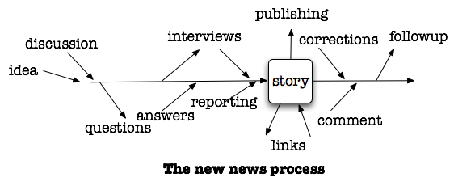

It is easier to publish than not to publish

Jeff Jarvis, <https://buzzmachine.com/2009/06/07/processjournalism/>

##

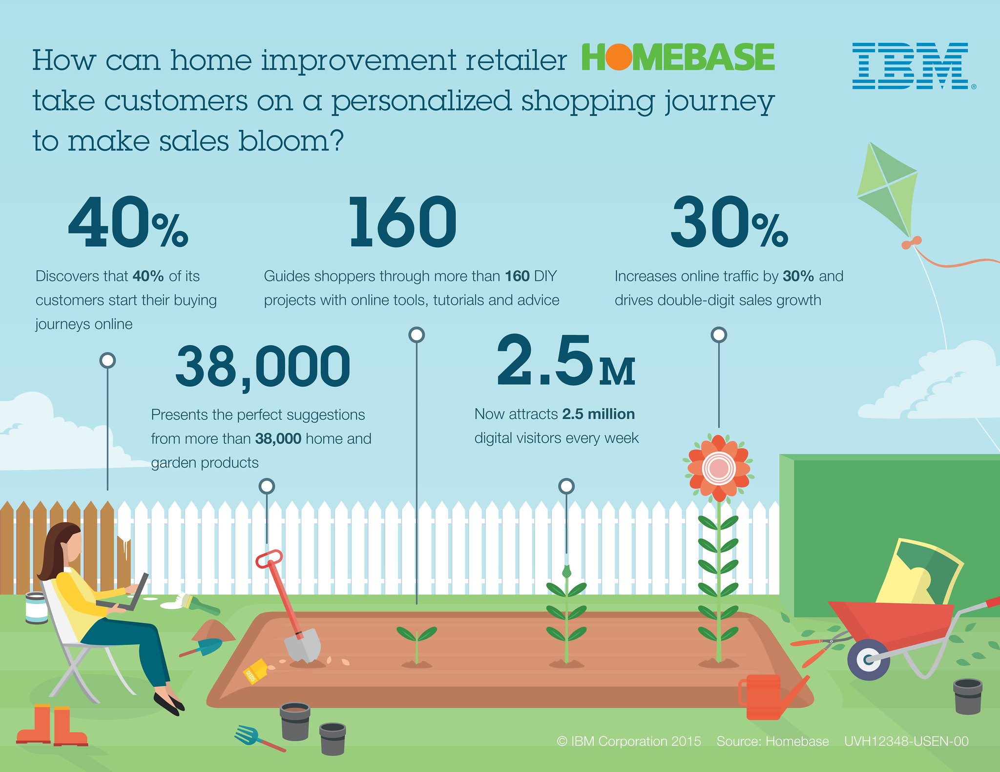{width=70%}

Customers inform themselves online before all

IBM Corporation https://www.flickr.com/photos/ibm_media/17368229178

##

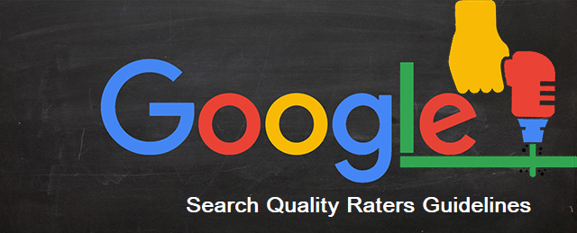

Search engines promote quality content

##

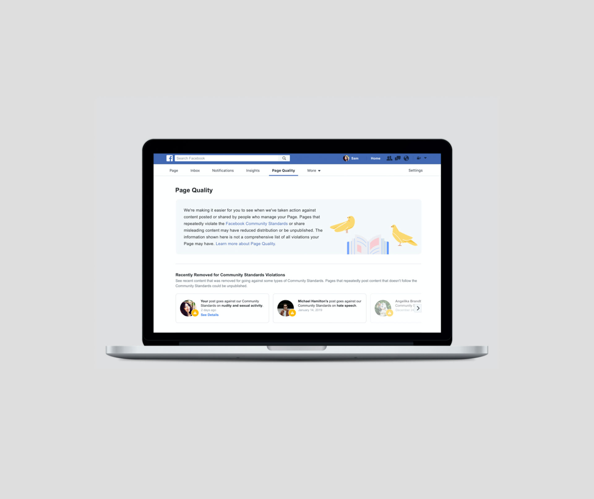{width=60%}

In social media good content is a conditon for success

Quelle: <https://allfacebook.de/pages/neues-page-quality-tab-auf-allen-facebook-seiten-fuer-euch-hoffentlich-irrelevant>

##
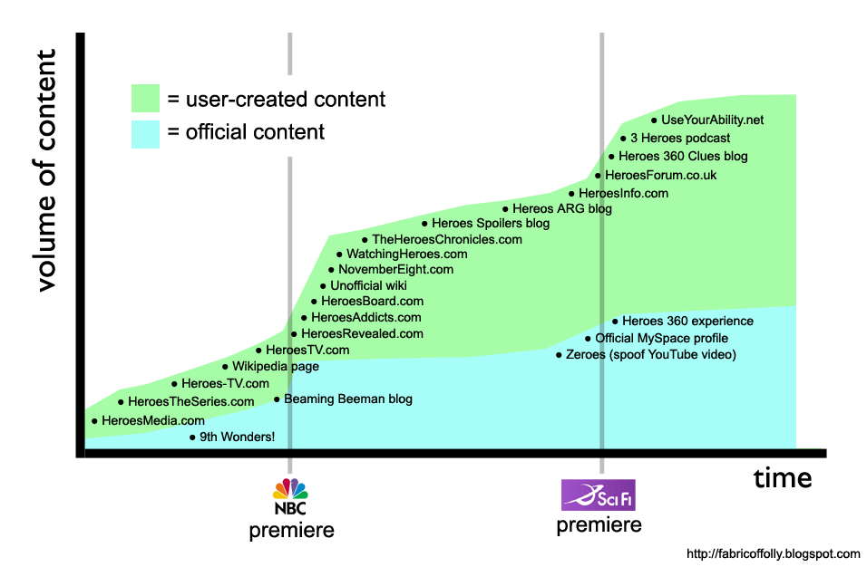{width=70%}

Content everywhere: from digital to mobile revolution

Quelle: Dan Taylor-Watt <https://www.flickr.com/photos/dantaylor/456525358>

##
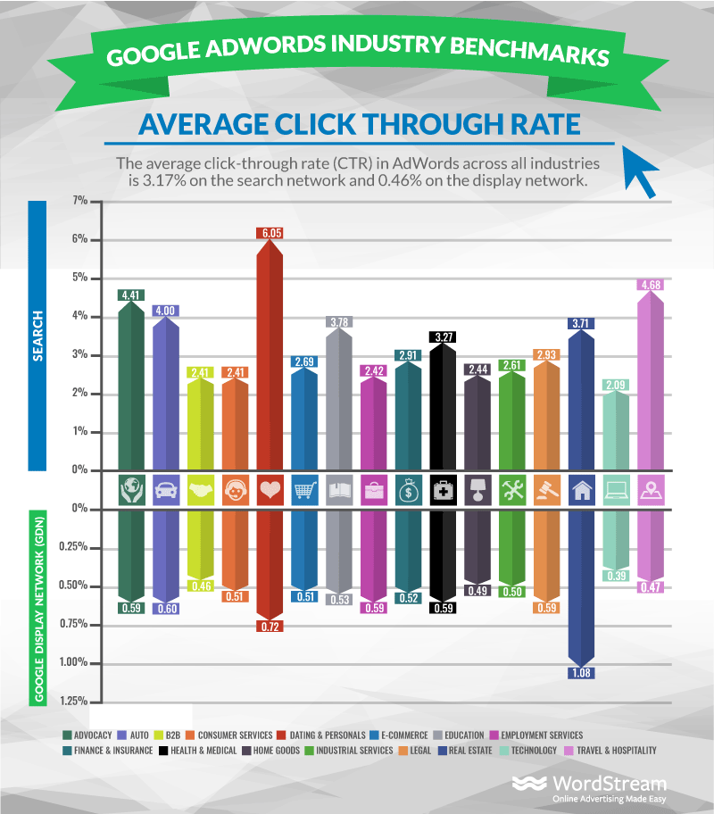{width=50%}

Classical ads and banners have lost traction

Quelle: Average display advertising clickthrough rates <https://www.smartinsights.com/internet-advertising/internet-advertising-analytics/display-advertising-clickthrough-rates/>

##

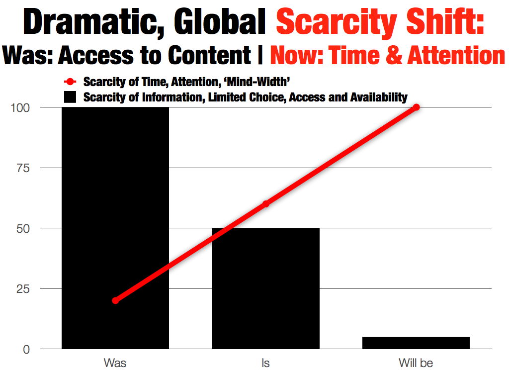{width=70%}

Scarcity of attention has replaced scarcity of information

Quelle: Futurist Gerd Leonhard at MLove 2013: key slides on the future of media <https://www.flickr.com/photos/gleonhard/9112922607>

##

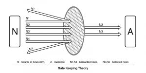

Filters are replacing gatekeepers and mediators

<https://www.reddit.com/r/gatekeeping/comments/9pytqo/gatekeepers_be_crazy_can_i_get_an_amen/>

##

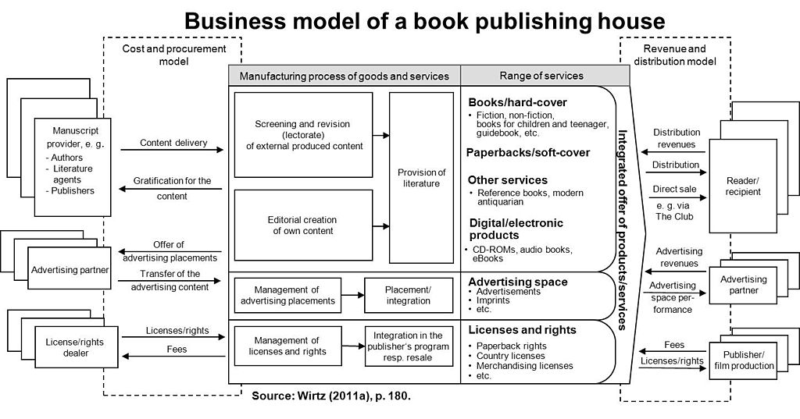{width=80%}

Business models of publishing houses and media companies have become obsolete

Bernd W. Wirtz [CC BY 2.0 de](https://creativecommons.org/licenses/by/2.0/de/deed.en)

##

> The era of one-way, single-threaded, brand-directed mass communications is officially over. ... The only way to reach your audience in today’s information-drenched, content-saturated world is through Epic Content Marketing... "

Joe Pulizzi (@pulizzi2013a, loc. 96-104)

##

> Content marketing is owning media as opposed to renting it  

Joe Pulizzi (@pulizzi2013a, loc. 244)

# Changing relations between brands and customers

##

[Why Problem Solving Should Be The Only Value Proposition You Use](https://neilpatel.com/blog/problem-solving-value-proposition/ "Why Problem Solving Should Be The Only Value Proposition You Use")

Customers regard brands as networked problem solvers

##

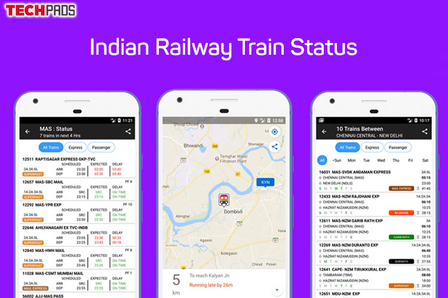

Customers and brands are connected 24/7 in realtime

##

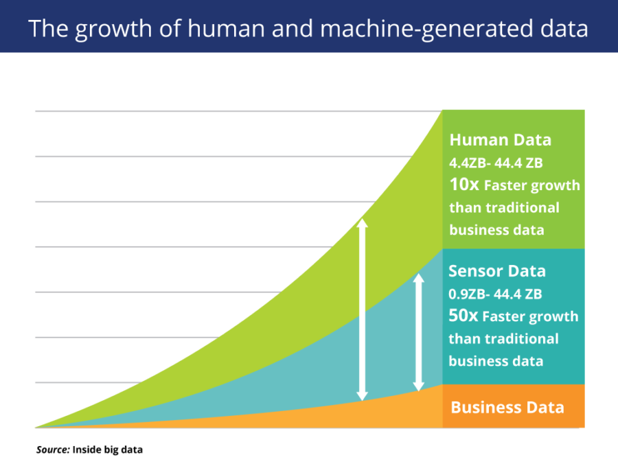

The mass of disposable data is growing exponentially

# Owned media as alternative to paid media

##

> "Content marketing is a strategic marketing approach focused on creating and distributing valuable, relevant, and consistent content to attract and retain a clearly-defined audience — and, ultimately, to drive profitable customer action."

<http://contentmarketinginstitute.com/what-is-content-marketing/>

##

- Content-Marketing is about content published by brands which

1. satisfies an interest for content which does not end with the purchase of a product,
2. supports sales.

##

- Content Marketing is a task for content strategists.
- It is closely related to other purposes of content (e.g PR, Service).

## {data-background="https://www.flickr.com/photos/toprankblog/7942982406"  data-background-size="contain"}

## {data-background="https://media.buch.de/img-adb/34962343-00-00.jpg"  data-background-size="contain"}

@pulizzi2013a

<!--

 -->

##

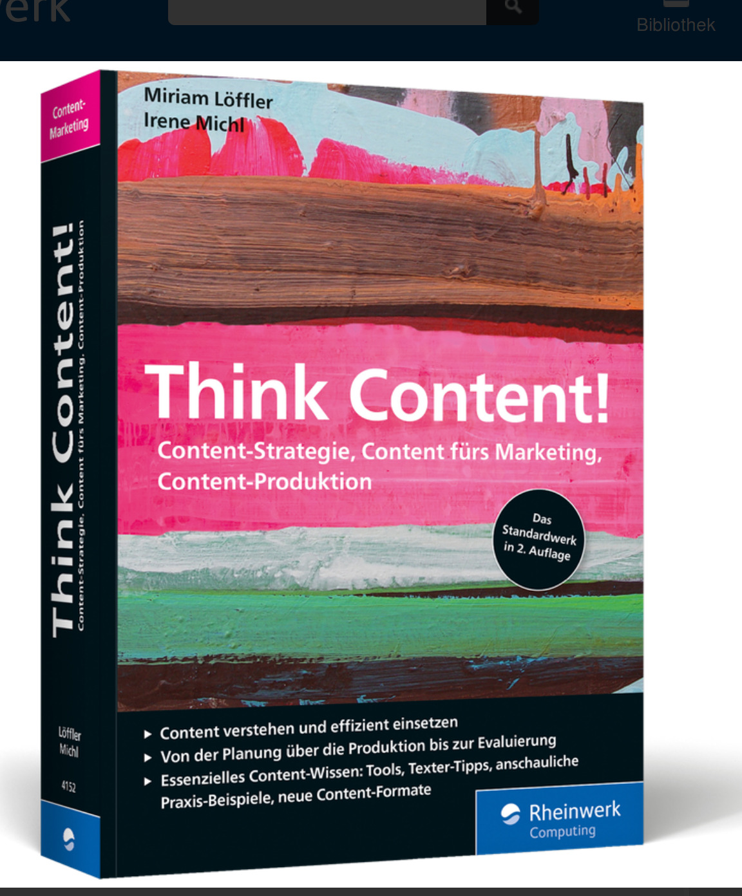{width=60%} @loefflerThinkContentStandardwerk2019

##

 @eckContentRevolutionImUnternehmen2014

##

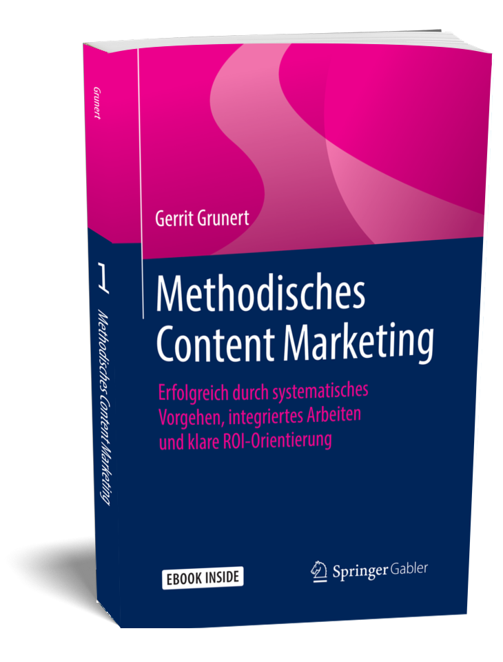{width=60%} @grunertMethodischesContentMarketing2019

# History of Content Marketing

##

[{width=30%}](http://contentmarketinginstitute.com/2016/07/history-content-marketing/)

Please include attribution to contentmarketinginstitute.com with this graphic

# Methodic Content Marketing (after G. Grunert @grunertMethodischesContentMarketing2019)

## Data as foundation

> "Scalable and predictable content marketing is based on the evaluation of large amounts of data collected on your own platforms or delivered by third-party platforms" (G. Grunert @grunertMethodischesContentMarketing2019)

## Personalisation

> "As the individual user is at the centre of content marketing, the personalisation of the content is decisive for the success of the measure."
 (G. Grunert @grunertMethodischesContentMarketing2019)

## Role of the editorial staff

- Creation and adaptation of content in any form, whether image, text, video or graphic.
- It works closely with marketing, from which it receives briefings on the definition of personas, communication and conversion goals.

##

> "The marketing department mixes the pizza dough, the editorial department rolls out the pizza dough."

(G. Grunert @grunertMethodischesContentMarketing2019)

## Competences and role of the Content Marketing Manager

- Understanding of how the relevant communication channels work.
- Think in a structured and process-oriented way and develop an understanding of the mindsets of the departments involved.
- Need to enjoy analysis, develop business acumen and yet be creative.
- Link between the departments, without them the silos cannot be broken open and the project cannot be implemented.

(Adapted from: G. Grunert @grunertMethodischesContentMarketing2019)

## Phases of the Customer Journey

- Awareness
- Consideration
- Decision

## Awareness

- The user notices that he has a problem. The information he seeks at this stage is intended to help him concretize the problem. He becomes aware of his problem.

(Adapted from: G. Grunert @grunertMethodischesContentMarketing2019)

## Consideration

- The user can give his problem or his accepted solution a concrete name. He is now looking for information that will enable him to solve the problem. He evaluates the problem and the solution offered.

(Adapted from: G. Grunert @grunertMethodischesContentMarketing2019)

## Decision

- He compares the different information to consolidated solution offers and makes the purchase decision.

(Adapted from: G. Grunert @grunertMethodischesContentMarketing2019)

## Customer journey and conversion funnel

> "The Customer Journey and the Conversion Funnel are two perspectives on the same thing, the process of winning customers. The concept of the Customer Journey does this by describing current conditions, e.g. where the user is in which phase and how these phases relate to each other. It is a passive, descriptive view in our opinion."

(G. Grunert @grunertMethodischesContentMarketing2019)

## Conversion funnel and future states

> "The conversion funnel model describes future conditions, because we are constantly asking ourselves what we have to do to achieve the desired effect in the future for our future customers. It's a more active, more creative way of looking at things."

(G. Grunert @grunertMethodischesContentMarketing2019)

## Conversion Funnel and Key Performance Indicators

- Each method used within the funnel has its own characteristics, the key performance indicators::
- SEO: Rankings, keywords, search volumes
- Email Marketing: Opening figures, Click-Through-Rates, Number of subscribers
- Lead Nurturing: Lead score

(Adapted from: G. Grunert @grunertMethodischesContentMarketing2019)

## Data integration

> "Likewise... the corresponding technical platforms provide us with the corresponding data. In order to be able to accompany the user through the conversion tunnel on his customer journey, we have to measure and consolidate this data in one platform in order to be able to track the conversion across all channels.""

(G. Grunert @grunertMethodischesContentMarketing2019)

## Role of the editorial staff

> ... that 99% of the information seems to be concerned with the marketing aspects of content marketing. Yet content is the currency with which we pay users for their attention and data. This chapter is therefore dedicated to the trade responsible for the production of this currency, the editorial department.

(G. Grunert @grunertMethodischesContentMarketing2019)

## Specifities of content

> "Content is a product whose production can hardly be scaled: At first glance, every reader can see whether an editor has taken the time to reflect on a topic in detail or whether a text has been created automatically on the basis of structured product data, for example.""

(G. Grunert@grunertMethodischesContentMarketing2019)

##

> "The work of the content marketing editorial team is particularly important in the Top of Funnel. At the beginning of the customer journey, neither advantage communication nor cost-benefit argumentation are in the foreground. In this phase, contexts and theme worlds are developed. The user's question "what all this has to do with him" must be answered."

(G. Grunert @grunertMethodischesContentMarketing2019)

# Facts: Content Marketing

##

[CONTENT MARKETING MARKETING B2C 2018 Benchmarks, Budgets, and Trends—North America](https://contentmarketinginstitute.com/wp-content/uploads/2017/12/2018_B2C_Research_Final.pdf)

##

[2018 B2B Content Marketing Report: CMI & MarketingProfs](https://www.toprankblog.com/2017/10/2018-b2b-content-marketing/)

# Theses

##

1. Brands today have different and by far more touch points with customers than they used to have. On the other site they are losing the traditional media channels controlled by their budget in a quasi monopolistic way.

##

2. Control of the digital touchpoints has been transferred to the customers.

##

3. The value propositions of brands are getting more complex and more networked. Brands are perceived as parts of a media world.

##

4. For these reasons brands are transformed into complex content offers. Content provides opportunities for continuous interaction from raising awareness to consolidating loyality.

##

5. Only radically user centered content marketing provides the chance to reach customers in a manner not limited to isolated contacts and interactions.

## Make the customer the hero of your story

<iframe width="560" height="315" src="https://www.youtube.com/embed/nkqVm5aiC28" frameborder="0" allow="accelerometer; autoplay; encrypted-media; gyroscope; picture-in-picture" allowfullscreen></iframe>

[Make Your Customer the Hero of Your Story: 'The Fault in Our Stars' Video](https://annhandley.com/make-your-customer-the-hero-of-your-story/ "Make Your Customer the Hero of Your Story: 'The Fault in Our Stars' Video")

# Discussion

##

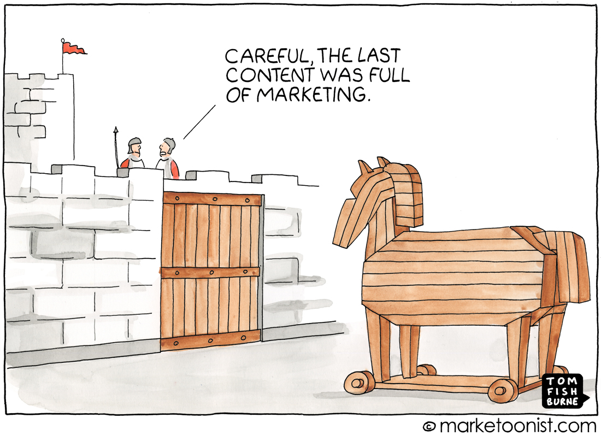

##

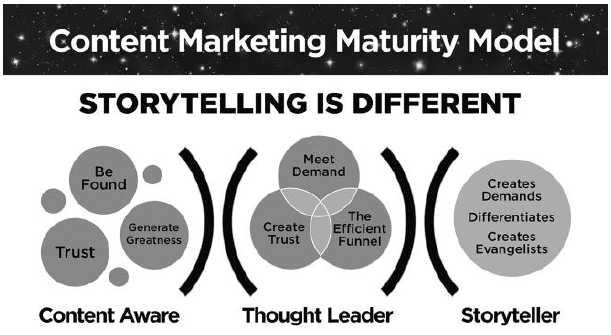

##

<blockquote class="twitter-tweet" data-lang="de">
Content marketing says: &quot;Brainstorm what content your audience wants, then distribute it wherever they are.&quot;  Content strategy says: &quot;Your audience could care less about your content until they need it. Better talk to them and figure out when, what, and where that is.&quot;
&mdash; Kristina Halvorson (\@halvorson) <a href="https://twitter.com/halvorson/status/1093215902164766720?ref_src=twsrc%5Etfw">6. Februar 2019</a></blockquote>

##

[Thomas Strerath über die Content-Lüge | W&V](https://www.wuv.de/agenturen/thomas_strerath_ueber_die_content_luege "Thomas Strerath über die Content-Lüge | W&V")

["Content-Marketing hat uns der Teifl gebracht"](https://www.derstandard.at/story/2000048289368/content-marketing-hat-uns-der-teifl-gebracht "Unabhängiger Journalismus: "Content-Marketing hat uns der Teifl gebracht" - Kommentare der anderen - derStandard.at › Diskurs")

##

> Content marketing in 2018 has not been a trend topic anymore, that was in 2016/2017, that is about the zenith. The work with influencers has become normal and is no longer hype. We were able to score with a systematic approach that combines AI with human creativity and intelligence. We call this "Trufluence™".

[prmagazin: Wolfgang Lünenbürger-Reidenbach](http://www.prmagazin.de/meinung-analyse/hintergrund/wolfgang-luenenbuerger-reidenbach.html "prmagazin: Wolfgang Lünenbürger-Reidenbach")

## Bibliography
